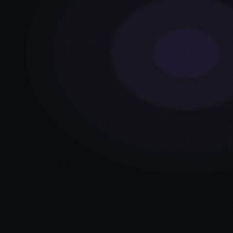

  <!-- BANNER TOPO -->
  

  

    <strong>Lead Frontend Developer | Creative Technologist & Arquiteto Web</strong> 
    <em>Especialista em React, Next.js, WebGL (Three.js / R3F) e Performance em Escala</em>
  

  

    
    
    
  

---

## 📌 Sobre Mim

Desenvolvedor Frontend Sênior com sólida trajetória na concepção e entrega de produtos digitais escaláveis, acessíveis e de alta fidelidade visual. Combino arquitetura de sistemas reativos modernos com computação gráfica na web.

- 🌐 **Hub Oficial:** [renanaugusto.com.br](https://www.renanaugusto.com.br)
- 💻 **Engenharia Frontend:** Arquitetura modular, Design Systems, SSR/SSG e TypeScript estrito.
- 🎮 **Creative Dev & 3D:** Shaders GLSL, Three.js, React Three Fiber e animações interativas.
- ⚡ **Performance:** Otimização contínua de Core Web Vitals e renderizações a 60fps.
- 📬 **Contato Direto:** [contato@renanaugusto.com.br](mailto:contato@renanaugusto.com.br)

 

---

## 🛠️ Stack Tecnológica

  
<strong>Frontend Core & Frameworks</strong>

  
  
    

  
<strong>3D, Animações & Ferramentas Visuais</strong>

  

    

  
<strong>DevOps, Cloud & Backend</strong>

  

---

## 🚀 Projetos em Destaque

### 🔹 [Plataforma Oficial](https://www.renanaugusto.com.br)
> Experiência imersiva integrando interface responsiva com shaders e canvas 3D interativo.
- **Stack:** `Next.js` • `Three.js` • `Tailwind CSS` • `TypeScript`
- 🔗 **Acesso:** [renanaugusto.com.br](https://www.renanaugusto.com.br)

---

### 🔹 Interactive 3D WebGL Canvas
> Motor visual com React Three Fiber, shaders GLSL e carregamento assíncrono de modelos 3D sem perda de taxa de quadros (60fps).
- **Stack:** `Three.js` • `React Three Fiber` • `GSAP` • `GLSL`
- 🔗 **Acesso:** [Repositório no GitHub](https://github.com/renanfrontend)

---

### 🔹 Design System & Componentes Modulares
> Biblioteca de UI acessível, altamente tipada e com foco em consistência visual e zero layout shift (CLS).
- **Stack:** `React` • `TypeScript` • `Storybook` • `Tailwind CSS`
- 🔗 **Acesso:** [Repositório no GitHub](https://github.com/renanfrontend)

---

## 📊 Métricas & Atividade no GitHub

  
  
    

  
  
    

  

---

  Construído por <strong>Renan Augusto</strong> • <a href="mailto:contato@renanaugusto.com.br">contato@renanaugusto.com.br</a>

